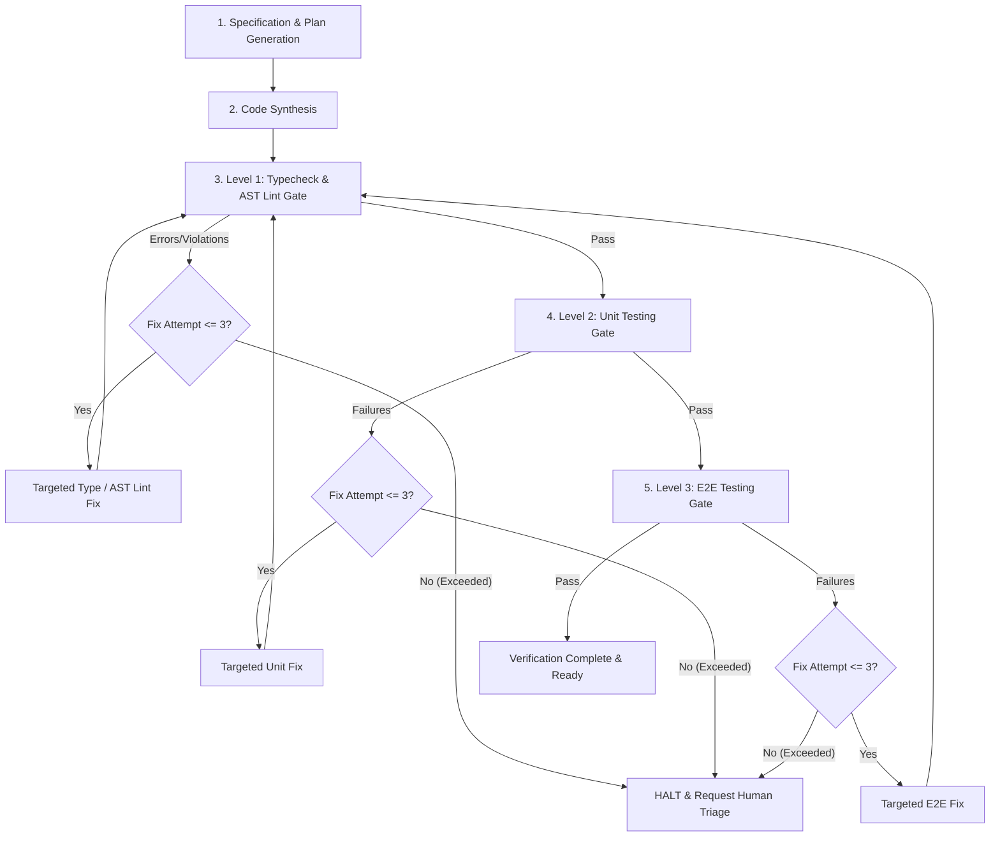

# Autonomous Self-Healing Diagnostic & Remediation Protocol

This protocol guides the agent through diagnosing and repairing issues across the 3 verification gates while enforcing bounded iterations, programmatic AST rules, and safety guardrails.

## The 5-Phase Autonomous Engineering Loop

## Remediation Workflow by Gate

### Gate 1: TypeScript & ESLint AST Errors (`run_typecheck.sh`)

#### TypeScript Compiler Errors (`tsc --noEmit`)
1. Extract file path, line number, and error code (e.g. `TS2322`, `TS2339`, `TS2345`).
2. Read the surrounding source code around the line.
3. Check the type contract:
   - Are required props missing from a component invocation?
   - Is a property accessed on a type that could be `undefined` or `null`? Add null-checks or narrowing.
   - Did the API payload schema change? Update the zod schema or interface definition.
4. **Never** suppress errors with `@ts-ignore` or cast to `any`.
5. Apply the minimal targeted diff.

#### ESLint AST Guardrail Errors (`eslint`)
1. **`ui-guardrails/ban-raw-html-primitives`:**
   - *Error:* `Raw <button> is prohibited. Import the standardized design token primitive from '@/components/ui/Button' instead.`
   - *Fix:* Replace `<button>` with `<Button>`, `<input>` with `<Input>`, `<select>` with `<Select>`, `<textarea>` with `<Textarea>`. Ensure the corresponding `@/components/ui/*` primitive is imported.
2. **`ui-guardrails/enforce-compound-subcomponents`:**
   - *Error:* `Direct usage of flat subcomponent '<CardHeader>' is prohibited. Use the compound dot-notation '<Card.Header>' instead.`
   - *Fix:* Import the parent namespace (e.g. `import { Card } from "@/components/ui/card"`) and rewrite markup to dot-notation (e.g. `<Card.Header>`, `<Card.Title>`, `<Card.Content>`, `<Dialog.Trigger>`).
3. **`boundaries/element-types` or `boundaries/entry-point`:**
   - *Error:* Disallowed layer dependency (e.g., UI primitive importing from feature component or page).
   - *Fix:* Move shared utilities to `src/lib/`, extract business logic to a hook, or refactor the UI primitive to be purely presentational.
4. **`max-lines` (Limit: 180 lines):**
   - *Error:* File exceeds 180 lines.
   - *Fix:* Decompose into smaller composable child components or extract stateful logic into a custom hook in `src/lib/hooks/`.

---

### Gate 2: Unit Test Failures (`vitest run`)
1. Review the test assertion failure message and the diff (`Expected` vs `Received`).
2. Determine if the failure is:
   - A logic defect in the component or utility function.
   - An outdated test expectation following an intentional design change.
3. Update only the code responsible for the assertion failure.
4. If modifying component markup, ensure `data-testid` and ARIA attributes remain intact.
5. Re-run Gate 1 and Gate 2.

---

### Gate 3: E2E Failures (`playwright test`)
1. Check `test-results/results.json` and error logs.
2. Locate the failure step (e.g., locator timeout, assertion timeout, network failure).
3. If locator failed:
   - Inspect the component markup to verify `data-testid="..."` exists and is rendered.
   - Ensure condition or loading spinner resolves so the target element is visible.
4. If visual screenshot or page snapshot failed:
   - Check the screenshot artifact in `test-results/`.
   - Identify visual layout breakages (e.g., Tailwind class typo, overflow issue).
5. Apply targeted fix.
6. Re-run Gate 1, Gate 2, and Gate 3.

---

## Bounded Iteration Enforcement (3-Cycle Rule)
- Maintain an internal counter for successive repair cycles on any specific issue.
- **Cycle 1:** Diagnose and apply most direct targeted fix.
- **Cycle 2:** If the same or related error persists, re-examine assumptions, dependencies, and imports.
- **Cycle 3:** Attempt final architectural adjustment.
- **Cycle 4 (Halt Trigger):** If still failing after 3 attempts:
  - STOP immediately.
  - Do NOT make further speculative edits.
  - Present the user with:
    1. The exact error messages and call stacks.
    2. The 3 attempted remediation strategies and why each did not resolve it.
    3. Specific questions or recommendations for human-in-the-loop intervention.
